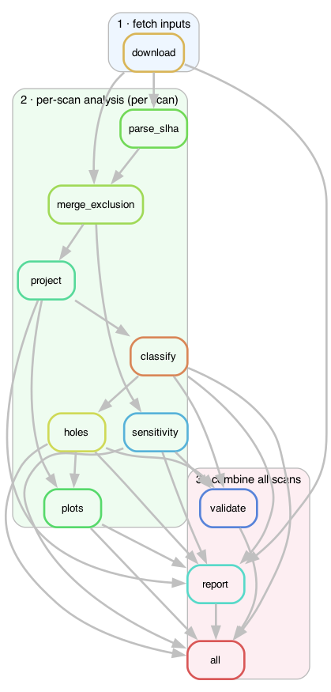

# Run-3 EWK SUSY search targets from the ATLAS pMSSM scan

A small, fully reproducible study built on the public data of the ATLAS Run-2
electroweak pMSSM scan ([arXiv:2402.01392](https://arxiv.org/abs/2402.01392),
analysis SUSY-2020-15).

**Goals:**
1. find pMSSM models that are **not excluded today** but where ATLAS is
   **expected to gain sensitivity in LHC Run 3**, grouped into physics classes;
2. flag **coverage holes** — viable, light models the programme cannot even
   *expect* to constrain, which more luminosity will **not** fix.

The whole study is orchestrated with **Snakemake** and runs inside a **pixi**
environment, so it reproduces exactly on any machine.

---

## How to reproduce (the only commands you need)

You need [pixi](https://pixi.sh) installed (`curl -fsSL https://pixi.sh/install.sh | bash`).
Everything else — Python, Snakemake, the scientific stack, even `curl` and the
input data — is handled by the pipeline from the pinned `pixi.lock`.

From the repository root:

```bash
pixi install        # create the locked environment (one-time, ~1-2 min)
pixi run run        # download inputs (if missing) + run the entire study
```

The first step (`download`) fetches the ATLAS SLHA tarballs and exclusion CSVs
into `data/`, so a fresh checkout needs **no manual data step**. Other commands:

```bash
pixi run plan       # dry-run: print the jobs that would execute
pixi run dag        # render the rule graph to docs/dag.png (+ .svg)
pixi run clean      # delete results/ to force a clean re-run
```

To re-run after changing an assumption (e.g. the target luminosity), edit
`config/config.yaml` and run `pixi run run` again — Snakemake re-executes only
the steps whose inputs or parameters changed.

## The pipeline (DAG)



`download → parse_slha → merge_exclusion → project → {classify, plots}`, then
`classify`/`holes` fan into `report` and `validate`. Regenerate this image with
`pixi run dag`.

| Step | What it does |
|---|---|
| **download** | Fetch the SLHA tarballs + exclusion CSVs from the ATLAS page into `data/` (skipped if present). |
| **parse_slha** | Stream every `.slha` spectrum from the tarball; extract masses, gaugino/higgsino composition (neutralino mixing matrix), mass splittings, chargino lifetime, dominant decay modes. |
| **merge_exclusion** | Join with the per-analysis expected/observed CLs from the CSV (keyed by `Model_number`). |
| **project** | Scale each of the 8 recastable searches' *expected* significance from 140 → target fb⁻¹; flag **targets**. |
| **classify** | Assign each target to a physics class (compressed higgsino, on-shell WZ, Wh→1ℓbb, off-shell, disappearing track, …). |
| **holes** | Find **coverage holes**: viable, light models with no expected sensitivity (not luminosity-fixable). |
| **plots** | Mass-plane figures (excluded / allowed / target / hole). |
| **report** | Assemble `results/report.md` + `results/class_summary.csv`. |
| **validate** | Assert pipeline invariants; fails the build on any violation. |

### Target definition

A **target** is currently **not excluded** (observed CLs ≥ 0.05), **not even
expected to be excluded now** (expected CLs ≥ 0.05), **but** projected-excluded
(projected CLs < 0.05) at the target luminosity — *and* it must pass the required
external constraints (EW + Flavour by default; see below).

### A coverage **hole**

is a model that is _viable_ (passes EW + Flavour), _light_ (min(m_χ₁±, m_χ₂⁰) ≤
`hole_mass_max_gev`, so copiously produced), yet _invisible_ (min expected CLs ≥
`hole_expcls_min`). Because there is essentially no expected sensitivity, the √L
projection does not help — these need a **new or re-optimised search**.

### What you get

| Output | Meaning |
|---|---|
| `results/report.md` | **Read this first** — headline numbers, target classes, **coverage holes**, benchmarks, caveats. |
| `results/class_summary.csv` | Target counts per class × scan. |
| `results/validation.txt` | Pass/fail of every invariant check. |
| `results/<scan>/targets.parquet` | Flagged target models with features, projection, class. |
| `results/<scan>/holes.parquet` | Coverage-hole models. |
| `results/<scan>/projected.parquet` | All models with current + projected exclusion status + constraint flags. |
| `results/<scan>/mass_plane.png` | Mass-plane plots. |

### Key knobs (`config/config.yaml`)

| Setting | Default | Meaning |
|---|---|---|
| `target_lumi_fb` / `baseline_lumi_fb` | `450` / `140` | Run-3 target vs Run-2 baseline luminosity. |
| `projection` | `sqrtL` | `sqrtL` (stat-limited) or `sqrtL_syst` (systematics floor, conservative). |
| `require_constraints` | `[EW, Flavour]` | External constraints a target must pass (`0 = excluded`). DM is reported but not imposed (cosmology-dependent). |
| `cls_threshold` | `0.05` | CLs below this ⇒ excluded at 95% CL. |
| `hole_mass_max_gev` / `hole_expcls_min` | `300` / `0.90` | Coverage-hole thresholds. |
| `compressed_dm_max_gev` / `llp_ctau_min_mm` | `35` / `1.0` | Class cuts: "compressed" Δm; long-lived chargino cτ. |

---

## Headline results (defaults)

Applying the external constraints matters a lot — the collider-only count is
dominated by models other measurements already disfavour:

| Scan | Total | Excluded now | Collider-only targets | + EW+Flavour | + DM too |
|---|---:|---:|---:|---:|---:|
| EWKino | 12 280 | 2 355 | 364 | **251** | 41 |
| Bino-DM | 8 897 | 2 590 | 420 | **313** | 47 |

**Coverage holes:** 216 (EWKino) + 13 (Bino-DM), **none** fixable by Run-3
luminosity. They are overwhelmingly **compressed higgsinos** (EWKino) and
**compressed binos** (Bino-DM) — near-degenerate spectra (Δm ~ few GeV) with
decay products too soft for current selections, viable down to ~100 GeV.

---

## Repository layout

```
.
├── pixi.toml / pixi.lock        # reproducible environment (pinned; osx-arm64/osx-64/linux-64)
├── config/config.yaml           # all study parameters
├── workflow/
│   ├── Snakefile                # the DAG
│   └── scripts/                 # download via rule; parse_slha, merge, project,
│                                #   classify, holes, plots, report, validate
├── data/                        # ATLAS inputs, fetched by the `download` rule (git-ignored)
├── docs/dag.png                 # rendered rule graph (tracked)
└── results/                     # generated by `pixi run run` (git-ignored)
```

Input data provenance:
[ATLAS SUSY-2020-15 public page](https://atlas.web.cern.ch/Atlas/GROUPS/PHYSICS/PAPERS/SUSY-2020-15/inputs/ATLAS_EW_pMSSM_Run2.html)
and [HEPData ins2755168](https://www.hepdata.net/record/ins2755168).

## Method caveats

- `sqrtL` is the **statistics-limited** (optimistic) projection; set
  `projection: sqrtL_syst` for the conservative bound where reach saturates.
- Projections reuse the **published analyses' expected CLs** as a proxy; a
  genuinely new/optimised search could do better.
- Decay-mode tags use the **dominant** branching ratio from the SLHA tables, not a
  full final-state simulation. Observed-only channels (disappearing track, h→inv,
  mₐ) inform the current-exclusion status but are not projected.
- External constraints use the ATLAS-provided flags (`0 = excluded`); DM (relic
  density + direct detection) is reported but not imposed by default.
